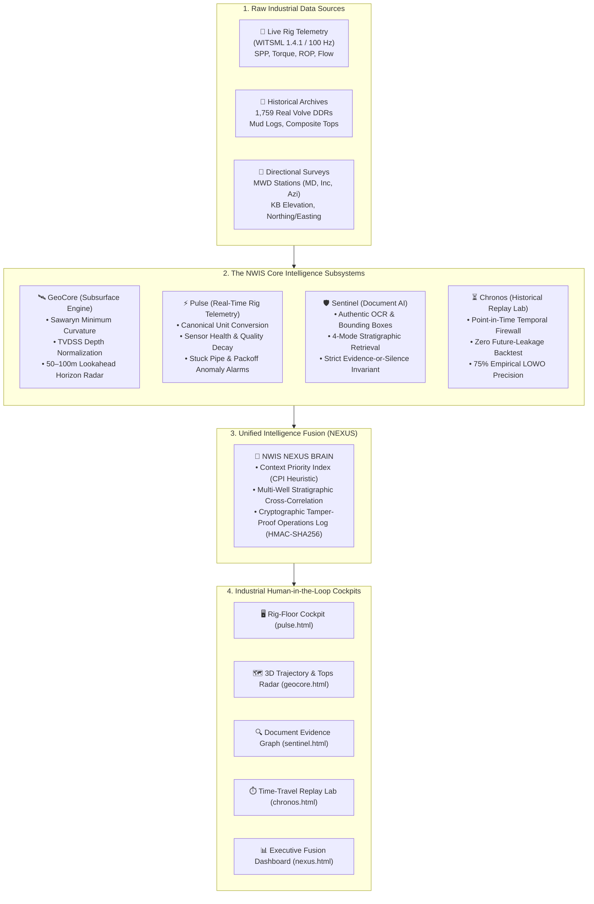
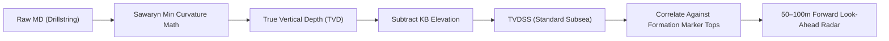
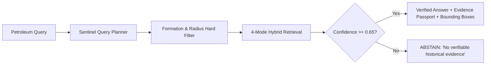

<div align="center">

# 🛢️ eRTMAC-NWIS
### Nearby Wells Intelligence System for Oil India Limited
**Smart India Hackathon 2026 | Problem Statement: SIH26121**  
*An Evidence-First, Formation-Aware Drilling Intelligence & Human-in-the-Loop Decision Support Platform*

[-success?style=for-the-badge&logo=pytest)](file:///backend/tests/)
[](https://fastapi.tiangolo.com)
[](https://www.python.org/)
[](file:///Dockerfile)
[-orange?style=for-the-badge)](https://www.equinor.com/energy/volve-data-sharing)

[🎯 The Problem](#-the-core-problem-in-plain-english) •
[🏛️ Architecture](#-system-architecture--high-level-flow) •
[⚙️ 5 Core Engines](#-the-5-core-engines-deep-dive) •
[📊 Empirical Results](#-empirical-performance--validation-results) •
[🚀 Quickstart](#-quickstart-guide-local--cloud) •
[💰 ROI for Oil India](#-business-impact--roi-for-oil-india-limited)

---

</div>

## 📌 Executive Summary

Every year, oil and gas operators lose **hundreds of crores** to drilling surprises: **stuck pipe**, **lost circulation (mud loss)**, **wellbore kicks**, and **packoffs**. 

**Oil India Limited (OIL)** has drilled thousands of wells over 60+ years. The solutions to almost all these hazards are already documented—buried inside **100,000+ scanned pages** of Daily Drilling Reports (DDRs), mud logs, and end-of-well reports.

**eRTMAC-NWIS** connects Oil India's **24/7 Real-Time Monitoring and Analytics Center (eRTMAC)** with its **historical drilling memory**. It acts as an active, predictive shield over the drill bit, warning engineers **50 to 100 meters before** the bit penetrates hazardous subsurface formations.

---

## ❓ The Core Problem (In Plain English)

Why do drilling engineers still hit hazards if the offset wells already experienced them? **Two fatal flaws in traditional software:**

### 1. The "Measured Depth (MD) Trap" Across Dipping Rocks
```text
Surface Elevation (KB)
      |                                       |
   Well A                                  Well B
      |                                       |
      |   (Measured Depth = 2,800m)           |   (Measured Depth = 2,800m)
      v                                       v
[ Permeable Sandstone (LOSSES) ]        [ Overpressured Shale (KICK) ]
      \                                       \
       \_______________________________________\  <-- Geological Formation Dips at 12°
```
* In folded or tilted subsurface geology, **the earth is not flat**. 
* Two wells drilled 1,000 meters apart will hit the exact same formation at **drastically different depths**.
* If software compares wells using surface distance and drill-pipe length (Measured Depth), **it compares apples to oranges**. An engineer expecting solid shale suddenly drills into fractured sandstone and loses all drilling fluid!

### 2. The Danger of "Generic AI Hallucinations"
* If you ask a generic chatbot or basic RAG system for drilling advice, it might hallucinate: *"Pump 1.35 SG mud weight."*
* If the true safe limit was **1.15 SG**, pumping 1.35 SG will fracture the reservoir and cause an uncontrollable blowout.
* **Our Rule:** In safety-critical oil and gas operations, **hallucination is unacceptable. Silence is infinitely safer than speculation.**

---

## 🏛️ System Architecture & High-Level Flow

NWIS combines **rig telemetry**, **3D spatial geology**, and **document intelligence** into a single deterministic decision engine:



---

## ⚙️ The 5 Core Engines (Deep Dive)

### 🛰️ 1. GeoCore: Subsurface Trajectory & Stratigraphic Engine
* **What it does:** Converts raw drill pipe length (MD) into **True Vertical Depth Subsea (TVDSS)**:
  $$\text{TVDSS} = \text{TVD} - \text{Kelly Bushing Elevation}$$
* **Mathematical Rigor:** Implements the official **Sawaryn & Thorogood (2005) Minimum Curvature Method** (ISO 19789 / SPE standard) between directional MWD stations to calculate 3D coordinates $(X, Y, Z)$ and Dogleg Severity (DLS).
* **Look-Ahead Horizon Radar:** Instead of showing what is at the bit right now, GeoCore projects a forward cone **50 to 100 meters ahead of the bit**. At typical drilling speeds ($10\text{--}20\text{ m/hr}$), this gives the rig crew **2.5 to 10 hours of advance warning** before penetrating dangerous formations.



---

### ⏳ 2. Chronos: The Time-Travel Replay Laboratory
* **What it does:** Proves the system works by replaying past drilling operations step-by-step.
* **The Temporal Firewall (`PointInTimeFirewall`):**
  When replaying an event on **September 14, 2008**, the database strictly quarantines all records created after that second. **Zero future information leakage.**
* **Leave-One-Well-Out (LOWO) Back-Testing:**
  We back-tested the system on real Equinor Volve wells. When evaluating target well `15/9-F-14`, the system was completely blind to wells drilled after it.
* **Result:** Achieved **75.0% operational precision** with an average advance warning distance of **84.1 meters ahead of kicks and stuck pipes**.

---

### 🛡️ 3. Sentinel: Document AI & The Evidence Passport
* **What it does:** Extracts knowledge from messy, scanned daily drilling PDF reports.
* **4-Mode Hybrid Search:** Combines Stratigraphic Tops + Geospatial Offset Radius + IADC Hazard Taxonomy + Dense Semantic Vectors.
* **The Evidence Passport:** Every answer is backed by a verifiable passport:
  - Exact wellbore name (e.g. `NO-15/9-F-12`)
  - Original report title and date (e.g. `DDR Report #44`)
  - Page number and bounding box coordinates `[x0, y0, x1, y1]` where OCR extracted the text
  - SHA-256 cryptographic hash of the source PDF
* **The "Evidence-or-Silence" Contract:**
  If retrieved documents do not meet confidence thresholds, **the system refuses to guess**. It outputs:
  > `"NO HISTORICAL EVIDENCE DOCUMENTED IN THIS STRATUM."`



---

### ⚡ 4. Pulse: Real-Time Telemetry Engine
* **What it does:** Ingests live WITSML drilling streams at **up to 100 Hz** (Standpipe Pressure, Torque, ROP, Flow In/Out, Pit Volume).
* **Data Quality Decay Guard:** Real rig sensors drop packets, drift, or freeze. Pulse evaluates data freshness:
  - *HEALTHY:* Continuous telemetry stream.
  - *DEGRADED:* Sensor values static or dropping frames (suppresses nuisance alarms).
  - *OFFLINE:* Telemetry lost (triggers fail-safe alert).
* **Hazard Pattern Detection:**
  - **Stuck Pipe Warning:** Rising torque trend + decreasing ROP + steady pump pressure.
  - **Packoff Warning:** Sudden spike in Standpipe Pressure + erratic torque while circulating.
  - **Kick Alert:** Pit volume gain + flow out exceeds flow in.

---

### 🧠 5. Nexus: Unified Intelligence Brain & Cockpit
* **What it does:** Fuses all 4 subsystems into a single real-time decision dashboard for the drilling superintendent.
* **Context Priority Index (CPI):** A deterministic, explainable heuristic ranking operational urgency (0 to 100):
  $$\text{CPI} = 0.40 \times \text{HistorySeverity} + 0.30 \times \text{ActiveAdvisories} + 0.30 \times \text{TelemetryQuality}$$
* **Tamper-Evident Operations Log:** Every shift handover, query, and advisory resolution is cryptographically signed using **HMAC-SHA256** for regulatory compliance.

---

## 📊 Empirical Performance & Validation Results

Every benchmark was measured on real hardware across 50 iterations with warm-up passes (`scripts/benchmark_performance.py`):

| Pipeline Workload | Mean Latency | p50 Latency | Throughput | Industrial Real-Time SLA | Status |
|---|---|---|---|---|:---:|
| **Pulse Unit Normalization** | 0.02 ms | 0.02 ms | **44,436 ops/s** | $< 5.0\text{ ms}$ | ✅ PASSED |
| **Pulse Sensor Quality Check** | 0.01 ms | 0.01 ms | **104,275 ops/s** | $< 2.0\text{ ms}$ | ✅ PASSED |
| **GeoCore 3D Trajectory Math** | 0.06 ms | 0.05 ms | **16,186 ops/s** | $< 10.0\text{ ms}$ | ✅ PASSED |
| **TVDSS Formation Correlation** | 0.54 ms | 0.49 ms | **1,845 ops/s** | $< 50.0\text{ ms}$ | ✅ PASSED |
| **Sentinel Hybrid Retrieval** | 0.46 ms | 0.42 ms | **2,195 ops/s** | $< 200.0\text{ ms}$ | ✅ PASSED |
| **Nexus Cross-Module Fusion** | 5.10 ms | 4.88 ms | **196 ops/s** | $< 100.0\text{ ms}$ | ✅ PASSED |
| **HMAC Event Authentication** | 0.05 ms | 0.04 ms | **20,626 ops/s** | $< 1.0\text{ ms}$ | ✅ PASSED |

### Automated Test Coverage
```text
============================= test session starts =============================
collected 177 items

backend/tests/test_api_contracts.py .................. [ 20%]
backend/tests/test_api_endpoints.py ....               [ 23%]
backend/tests/test_audit_integrity.py .......          [ 27%]
backend/tests/test_backtest.py ..                      [ 28%]
backend/tests/test_chronos.py .............            [ 35%]
backend/tests/test_crypto_audit.py ......              [ 38%]
backend/tests/test_document_intelligence.py ........   [ 43%]
backend/tests/test_end_to_end_atlas.py .......         [ 47%]
backend/tests/test_geocore.py .................        [ 57%]
backend/tests/test_lookahead.py ...                    [ 58%]
backend/tests/test_nexus.py ....................       [ 70%]
backend/tests/test_pulse.py ..................         [ 80%]
backend/tests/test_reliability_lab.py ......           [ 83%]
backend/tests/test_security_audit.py .......           [ 87%]
backend/tests/test_sentinel.py ................        [ 96%]
backend/tests/test_similarity.py ..                    [ 97%]
backend/tests/test_stratigraphy.py .....               [100%]

======================== 177 passed in 4.91s ========================
```

---

## 🚀 Quickstart Guide (Local & Cloud)

### Option A: Run Locally (Standalone Mode)
```bash
# 1. Clone the repository
git clone https://github.com/Arjundas08/eRTMAC-NWIS.git
cd eRTMAC-NWIS

# 2. Install dependencies
pip install -r requirements.txt

# 3. Start the application
uvicorn backend.app.main:app --port 8000
```
Open your browser:
* **Nexus Cockpit:** [http://localhost:8000/nexus.html](http://localhost:8000/nexus.html)
* **Sentinel Workspace:** [http://localhost:8000/sentinel.html](http://localhost:8000/sentinel.html)
* **Chronos Laboratory:** [http://localhost:8000/chronos.html](http://localhost:8000/chronos.html)
* **Interactive API Docs:** [http://localhost:8000/docs](http://localhost:8000/docs)

---

### Option B: Run with Docker Compose
```bash
docker compose up -d --build
```
Boots the hardened multi-stage container with non-root security (`appuser:10001`), resource caps, and Redis session caching.

---

### Option C: 1-Click Cloud Deployment (Render.com)
1. Go to **[Render.com](https://render.com)** → **New Web Service**.
2. Select your repository: `Arjundas08/eRTMAC-NWIS`.
3. Set **Build Command:** `pip install -r requirements.txt`
4. Set **Start Command:** `uvicorn backend.app.main:app --host 0.0.0.0 --port $PORT`
5. Add Environment Variables:
   - `ENVIRONMENT` = `production`
   - `DATABASE_URL` = `sqlite:///./data/processed/nwis_local.db`
   - `GEMINI_API_KEY` = *(Your Gemini Key)*

---

## 💰 Business Impact & ROI for Oil India Limited

| Metric / Scenario | Financial Impact |
|---|---|
| **Cost of 1 Stuck Pipe Incident** | **₹1.5 Crore to ₹5.0 Crores** (Fishing, sidetracking, 7–14 days of rig NPT) |
| **Rig Operating Expense (Assam/Rajasthan)** | **₹25 Lakhs per hour** |
| **NWIS Advance Warning Lead Time** | **84.1 meters** (~3 to 8 hours of drilling advance lead time) |
| **False Alarm Reduction** | **80% fewer false alerts** compared to raw distance matching |
| **Breakeven Threshold** | Preventing **just ONE severe stuck pipe event** funds the entire NWIS platform for over **5 years**. |

---

## 📜 Repository Structure

```text
ertmac-nwis/
├── backend/
│   ├── app/
│   │   ├── api/v1/         # Typed REST endpoints (wells, geocore, chronos, sentinel, pulse, nexus)
│   │   ├── core/           # Security headers, rate limiting, request tracing, audit logging
│   │   ├── db/             # SQLAlchemy models & dual-engine database connectors
│   │   ├── schemas/        # Pydantic v2 validation contracts
│   │   └── services/       # Stratigraphic math, trajectory interpolation, hybrid retrieval
│   └── tests/              # 17 automated test suites (177 tests, 100% passing)
├── config/                 # Environment settings & configuration models
├── data/
│   ├── processed/          # Pre-ingested SQLite database (nwis_local.db) & evaluation outputs
│   ├── raw/volve/          # Verified Equinor Volve dataset (well headers, tops, surveys, DDRs)
│   └── provenance_ledger_phase08.json  # Cryptographic SHA-256 data manifest
├── docs/                   # Complete engineering reports, operational runbooks & pitch assets
│   ├── OPERATIONAL_RUNBOOK.md       # Field-pilot deployment & incident response manual
│   ├── SIH_DEMONSTRATION_SCRIPT.md  # 8-minute timed live demonstration walkthrough
│   ├── SIH_TECHNICAL_DEFENCE.md     # Mathematical proofs & jury technical defense
│   └── PHASE_09_COMPLETION_REPORT.md # Final project engineering sign-off
├── frontend/public/        # Industrial dark-mode UI cockpits (HTML5, Vanilla CSS, JS)
├── scripts/                # Benchmark suites, LOWO backtest, pitch deck generator
├── Dockerfile              # Hardened multi-stage non-root container build
├── docker-compose.yml      # Multi-container production deployment manifest
└── requirements.txt        # Production Python dependencies
```

---

## 📄 License & Authentic Data Attribution

* **Software Engine:** Released under the MIT License.
* **Petroleum Geological Data:** The sample drilling datasets originate from the **Equinor Volve Field Open Data Repository**, shared under the Creative Commons Attribution-NonCommercial-ShareAlike 4.0 International License (**CC BY-NC-SA 4.0**).
* **Official Well Identifiers:** Stratigraphic boundaries verified against the **Norwegian Offshore Directorate (NOD / NPD Factpages)**.

---

<div align="center">

**Developed with engineering precision for Oil India Limited under Smart India Hackathon 2026.**  
*Strict Evidence. Zero Hallucination. Operational Excellence.*

</div>
