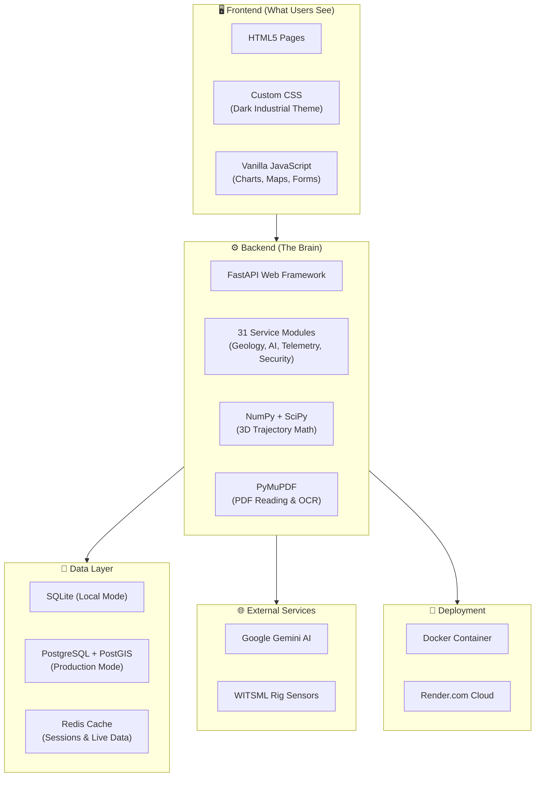
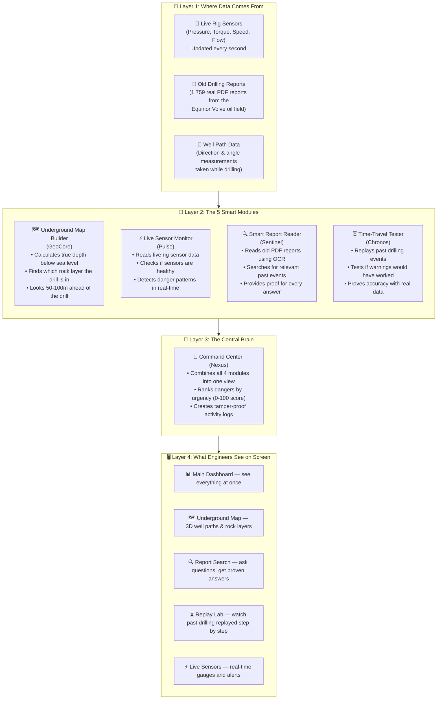
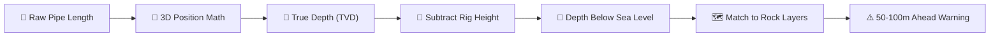
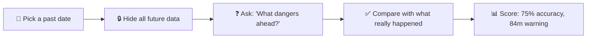
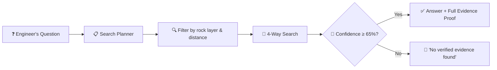

<div align="center">

# 🛢️ eRTMAC-NWIS
### Nearby Wells Intelligence System for Oil India Limited
**Smart India Hackathon 2026 | Problem Statement: SIH26121**  
*A smart drilling assistant that warns engineers about underground dangers — using real evidence from wells drilled in the past.*

[-success?style=for-the-badge&logo=pytest)](file:///backend/tests/)
[](https://fastapi.tiangolo.com)
[](https://www.python.org/)
[](file:///Dockerfile)
[-orange?style=for-the-badge)](https://www.equinor.com/energy/volve-data-sharing)

[🎯 The Problem](#-what-problem-does-this-solve) •
[🛠️ Tech Stack](#%EF%B8%8F-tech-stack--tools-used) •
[🏛️ How It Works](#%EF%B8%8F-how-does-the-whole-system-work-architecture) •
[⚙️ The 5 Brains](#-the-5-smart-modules-inside-nwis) •
[📊 Speed & Accuracy](#-how-fast-and-accurate-is-it) •
[🔌 API Endpoints](#-api-endpoints-how-the-frontend-talks-to-the-backend) •
[🔒 Security](#-security--safety-features) •
[🚀 How to Run It](#-how-to-run-the-app) •
[💰 Why It Matters](#-why-this-matters-for-oil-india)

---

</div>

## 📌 What Is This Project? (In One Paragraph)

When you drill an oil well, you're drilling blind into the ground — you can't see what's coming next. But here's the thing: **nearby wells that were drilled in the past already went through the same underground layers.** If a nearby well had problems (like getting stuck, losing drilling fluid, or hitting high-pressure gas), then **your well will probably face the same problems** when it reaches that same underground layer.

**eRTMAC-NWIS** is a software platform that **reads old drilling reports, understands the underground geology, watches the live drilling data, and warns engineers 50–100 meters BEFORE the drill reaches a dangerous zone.** Think of it like a "Google Maps for drilling" — but instead of showing traffic ahead on a road, it shows **underground hazards ahead of the drill bit.**

---

## 🛠️ Tech Stack & Tools Used

Here's every technology and tool used to build this platform:

### Backend (Server Side — The Brain)

| Technology | What It Does | Why We Use It |
|---|---|---|
| **Python 3.11+** | The main programming language for all backend logic | Most popular language for data science and AI — huge library support |
| **FastAPI** | The web framework that handles all incoming requests | Fastest Python web framework — auto-generates API docs, built-in data validation |
| **Uvicorn** | The web server that runs FastAPI | Asynchronous server — handles many requests at the same time |
| **Pydantic v2** | Checks that all incoming data is valid and correct | Catches bad input before it reaches the logic — prevents crashes |
| **SQLAlchemy 2.0** | Talks to the database using Python code (instead of raw SQL) | Makes database operations safe and readable |
| **Alembic** | Manages database structure changes over time | When we add a new table or column, Alembic upgrades the database smoothly |
| **NumPy** | Fast math calculations (arrays, matrices) | Powers the 3D trajectory math (Minimum Curvature calculations) |
| **SciPy** | Advanced scientific and statistical calculations | Used for geological interpolation and spatial algorithms |
| **Pandas** | Data processing and table manipulation | Cleans, filters, and transforms drilling data efficiently |
| **PyMuPDF (fitz)** | Reads and extracts text from PDF files | Processes scanned Daily Drilling Reports with bounding box coordinates |
| **Pillow** | Image processing library | Processes scanned document images for OCR |
| **python-jose** | Creates and verifies JSON Web Tokens (JWT) | Handles user authentication securely |
| **passlib + bcrypt** | Hashes and verifies passwords | Stores passwords safely — even if the database is stolen, passwords can't be read |
| **HTTPX** | Makes HTTP requests to external services | Communicates with the Gemini AI API |
| **WebSockets** | Real-time two-way communication | Streams live rig sensor data to the dashboard without page refresh |
| **python-pptx** | Creates PowerPoint presentations programmatically | Auto-generates pitch decks from data |
| **Pytest** | Runs automated tests | Ensures all 177 tests pass before any deployment |

### Frontend (What Engineers See on Screen)

| Technology | What It Does | Why We Use It |
|---|---|---|
| **HTML5** | Structure of every web page | The universal standard for web content |
| **Vanilla CSS** | Custom styling with dark industrial theme | Full control over the design — no framework bloat |
| **Vanilla JavaScript (ES6+)** | All interactive behavior — charts, maps, forms | No framework dependency — fast loading, works everywhere |
| **CSS Custom Properties** | Design tokens for consistent colors, spacing, typography | Change one variable → entire app theme updates instantly |
| **CSS Grid & Flexbox** | Responsive page layouts | Pages look good on desktops, tablets, and phones |
| **Fetch API** | Connects frontend to backend API | Modern browser-native way to send/receive data |

### Database & Storage

| Technology | What It Does | Why We Use It |
|---|---|---|
| **SQLite** | Lightweight local database (default mode) | Zero setup required — the entire database is a single file |
| **PostgreSQL 16 + PostGIS** | Production-grade database with geospatial support | Handles millions of records, spatial queries for well location search |
| **Redis 7** | In-memory cache for sessions and real-time data | Blazing fast read/write — perfect for live telemetry buffering |

### DevOps & Deployment

| Technology | What It Does | Why We Use It |
|---|---|---|
| **Docker** | Packages the entire app into a portable container | "Works on my machine" problems disappear — same everywhere |
| **Docker Compose** | Runs the full stack (app + database + cache) with one command | `docker compose up` starts everything together |
| **Multi-Stage Docker Build** | Separates build tools from the final image | Final container is smaller and more secure — no build tools inside |
| **Non-Root Container** | App runs as an unprivileged user inside Docker | Even if hacked, the attacker has no admin access |
| **Render.com** | Cloud hosting platform (free tier available) | Easy GitHub integration — push to `main` and it auto-deploys |
| **Git & GitHub** | Version control and code hosting | Track every change, collaborate, and review code |

### AI & Intelligence

| Technology | What It Does | Why We Use It |
|---|---|---|
| **Google Gemini API** | Large language model for natural language understanding | Powers the AI Copilot — interprets drilling questions intelligently |
| **OCR (via PyMuPDF)** | Reads text from scanned PDF images | Extracts knowledge from old hand-typed/scanned drilling reports |
| **4-Mode Hybrid Search** | Combines 4 search strategies into one | Much more accurate than using just one search method |
| **HMAC-SHA256** | Creates tamper-proof digital signatures | Every log entry is cryptographically signed — nobody can secretly edit it |

### Architecture Diagram of the Tech Stack



---

## ❓ What Problem Does This Solve?

Oil India Limited has been drilling wells for **60+ years.** Over that time, they've created **100,000+ pages** of daily drilling reports, mud logs, and well reports. The answers to almost every drilling danger are **already written in these old documents** — but nobody has time to manually search through thousands of pages in the middle of a drilling operation.

### Problem 1: Depth Numbers Are Misleading

Imagine two wells, both drilled 1 km apart. Both reach a depth of 2,800 meters. You'd expect them to hit the same rock layer, right? **Wrong.**

```text
Ground Level
      |                                       |
   Well A                                  Well B
      |                                       |
      |   (Pipe Length = 2,800m)              |   (Pipe Length = 2,800m)
      v                                       v
[ Soft Sandstone → LOST MUD ]          [ Hard Shale → HIGH PRESSURE ]
      \                                       \
       \_______________________________________\  ← The rock layers are TILTED
```

Underground rock layers are not flat — they are folded, bent, and tilted. So a pipe length of 2,800m in Well A hits a completely different rock than 2,800m in Well B.

**Old systems compare wells using pipe length (called "Measured Depth").** This is like comparing two roads by distance — ignoring that one road goes uphill and the other goes into a valley. You end up comparing apples to oranges.

**Our system fixes this** by converting all depths to a universal reference point: **True Vertical Depth Below Sea Level (TVDSS).** This way, we always compare the same actual rock layer, no matter how the well was drilled.

### Problem 2: Generic AI Can Guess Wrong — And That's Dangerous

If you ask a regular AI chatbot for drilling advice, it might confidently say: *"Use 1.35 SG mud weight."* But if the actual safe limit was **1.15 SG**, then pumping 1.35 SG **would crack the rock and cause a blowout** — one of the most dangerous things that can happen on a rig.

**Our rule: If the system doesn't have real evidence from real wells, it stays silent.** We'd rather give no answer than a wrong answer. This is called our **"Evidence-or-Silence" rule.**

> 💡 **In simple words:** The system only speaks when it has proof. No guessing. No making things up.

---

## 🏛️ How Does the Whole System Work? (Architecture)

The system has **4 layers**, each building on the one below:



**In simple words:**
1. **Data comes in** → from live rig sensors, old PDF reports, and well path measurements.
2. **5 smart modules process it** → they understand the geology, read documents, monitor live data, and test accuracy.
3. **The central brain combines everything** → it decides what's most urgent and creates a single view.
4. **Engineers see clear dashboards** → with warnings, maps, evidence, and live sensor gauges.

---

## ⚙️ The 5 Smart Modules Inside NWIS

### 🗺️ Module 1: Underground Map Builder (GeoCore)

**What it does in plain words:** It figures out the drill bit's exact position underground in 3D — and tells you what rock layers are coming up next.

**Why this is important:** When you drill, the pipe doesn't go straight down — it curves and bends. So the length of pipe in the ground (say 3,000 meters) doesn't mean the drill is 3,000 meters deep. It could be only 2,700 meters deep because the well path curved sideways.

**How it works (step by step):**
1. Takes the raw pipe length measurements
2. Uses an industry-standard math formula (called "Minimum Curvature Method") to calculate the drill's exact 3D position underground
3. Subtracts the height of the rig above sea level → now we know the **true depth below sea level**
4. Compares this depth against known rock layers from nearby wells
5. **Looks 50–100 meters ahead** of the current position to warn about upcoming dangers



> 💡 **Analogy:** Imagine driving on a hilly road. Your car's odometer says 10 km, but your actual altitude is different from someone who drove 10 km on a flat road. GeoCore calculates your actual altitude, not just the distance traveled.

---

### ⏳ Module 2: Time-Travel Tester (Chronos)

**What it does in plain words:** It replays past drilling operations day-by-day to prove that our warning system actually works — using real historical data.

**Why this is important:** Anyone can *claim* their software detects dangers. We need to *prove* it. Chronos does this by going back in time and testing: "If this system had existed back in 2008, would it have correctly warned about the problems?"

**How it works (step by step):**
1. Picks a well that was drilled in the past (e.g., Well F-14, drilled in 2008)
2. Sets a **strict time barrier** — the system can only see reports and data from BEFORE each test day
3. Asks the system: "What dangers lie ahead for this well?"
4. Compares the system's warnings against what actually happened
5. **Hides the target well's own data** — so the system can only learn from OTHER nearby wells (this is called "Leave-One-Well-Out" testing)

**Result:** The system correctly predicted dangers with **75% accuracy** and gave warnings **84 meters before** the drill reached the problem zone on average.

> 💡 **Analogy:** It's like testing a weather forecast app by going back to 2008 and checking: "Would it have correctly predicted the storms?" — without letting it cheat by looking at the actual weather data from that day.



---

### 🔍 Module 3: Smart Report Reader (Sentinel)

**What it does in plain words:** It reads thousands of old drilling PDF reports and answers questions about what happened in nearby wells — with full proof of where the answer came from.

**Why this is important:** Oil companies have decades of drilling reports sitting in filing cabinets and PDF folders. The knowledge is there, but nobody has time to read through all of them during a live drilling operation. Sentinel does this in seconds.

**How it works (step by step):**
1. Takes old PDF reports and reads them using OCR (Optical Character Recognition — like scanning a document)
2. Breaks the text into small searchable pieces
3. When an engineer asks a question (e.g., "Were there any stuck pipe events near formation X?"), it searches using **4 different methods at once:**
   - 🗺️ **By rock layer** — only looks at reports from the same underground formation
   - 📍 **By location** — only looks at reports from wells within a certain distance
   - 🏷️ **By hazard type** — matches the type of danger (stuck pipe, kick, mud loss, etc.)
   - 🔤 **By meaning** — understands the meaning of the question, not just exact words
4. Each answer comes with an **Evidence Passport** — a full receipt showing:
   - Which well the info came from
   - Which report and which page
   - The exact spot on the page where the text was found
   - A digital fingerprint (hash) of the original PDF to prove it hasn't been changed

**The "Evidence-or-Silence" Rule:** If the system can't find strong enough evidence (confidence below 65%), **it refuses to answer** and says:
> *"No historical evidence documented for this question."*



> 💡 **Analogy:** Imagine having a super-fast librarian who reads every report in seconds, but never makes up answers. If the librarian can't find proof, they say "I don't know" instead of guessing.

---

### ⚡ Module 4: Live Sensor Monitor (Pulse)

**What it does in plain words:** It watches the rig's live sensors in real-time and sounds the alarm when sensor patterns suggest something dangerous is about to happen.

**Why this is important:** Modern drilling rigs generate tons of live data — pressure readings, torque values, drilling speed, mud flow rates — all updated many times per second. A human can't watch all these numbers simultaneously. Pulse watches them 24/7 and spots danger patterns instantly.

**What it monitors:**
| Sensor | What It Measures | Example Danger Signal |
|---|---|---|
| **Standpipe Pressure (SPP)** | Pressure of mud being pumped down | Sudden spike → something is blocking the flow |
| **Torque** | How hard the drill is twisting | Rising torque → drill is getting stuck in rock |
| **Rate of Penetration (ROP)** | How fast the drill moves forward | Dropping ROP → drill is struggling |
| **Flow In/Out** | Mud going down vs. mud coming up | More mud coming up → underground fluid entering the well (KICK) |
| **Pit Volume** | Total mud volume in the surface tanks | Unexpected rise → gas or water pushing mud out |

**Sensor Health Check:** Before raising any alarm, Pulse first checks if the sensor data is reliable:
- 🟢 **Healthy** — sensors are sending good data
- 🟡 **Degraded** — sensors are freezing or dropping data (alarms are suppressed to avoid false warnings)
- 🔴 **Offline** — sensors have stopped responding (triggers a safety alert)

**Danger Patterns It Detects:**
- ⚠️ **Stuck Pipe Warning:** Torque going up + drilling speed going down + pressure staying the same
- ⚠️ **Blockage Warning:** Sudden pressure spike + erratic torque while circulating
- 🚨 **Kick Alert:** Mud tanks gaining volume + more fluid flowing out than going in

---

### 🧠 Module 5: Command Center (Nexus)

**What it does in plain words:** It combines information from ALL the other modules into a single screen that shows the most important things first — like a control tower at an airport.

**Why this is important:** Each module gives useful information, but an engineer doesn't want to switch between 5 different screens. Nexus brings everything together and ranks it by urgency.

**How it ranks urgency (the Danger Score):**

The system calculates a **Danger Score from 0 to 100** for every situation:

$$\text{Danger Score} = 0.40 \times \text{How bad was it in past wells} + 0.30 \times \text{Current active warnings} + 0.30 \times \text{Sensor data quality}$$

- **Score 0–30:** 🟢 Everything looks normal
- **Score 31–60:** 🟡 Pay attention — some warning signs
- **Score 61–100:** 🔴 Take action now — high danger

**Tamper-Proof Activity Log:** Every decision, every query, and every shift handover is saved with a digital signature (HMAC-SHA256). This means nobody can secretly edit the log — if anyone tries to change a record, the digital signature won't match, and the system will flag it.

> 💡 **Analogy:** Nexus is like the dashboard of a car — it combines the speedometer, fuel gauge, engine temperature, and GPS navigation into one view. You don't need to pop open the hood to know something's wrong.

---

## 🖥️ What Do the Screens Look Like?

Here's what each page in the app does:

| Screen | File | What You See |
|---|---|---|
| **🏠 Welcome Page** | `index.html` | Landing page with an overview and quick links to all features |
| **📊 Main Dashboard** | `nexus.html` | Everything combined — danger scores, active warnings, sensor status, recent events |
| **🗺️ Underground Map** | `geocore.html` | 3D view of well paths, rock layers, and the look-ahead danger zone |
| **🔍 Report Search** | `sentinel.html` | Ask questions about past wells — get proven answers with evidence |
| **⚡ Live Sensors** | `pulse.html` | Real-time gauges for pressure, torque, speed, and flow |
| **⏳ Replay Lab** | `chronos.html` | Replay a past drilling operation day-by-day to test the system |
| **📡 Nearby Wells Finder** | `radar.html` | Find wells near your current location with a radius search |
| **🔬 Rock Layer Viewer** | `stratigraphy.html` | See which rock layers exist at different depths |
| **⚠️ Ahead-of-Bit Scanner** | `lookahead.html` | See what dangers the drill will face in the next 50–100 meters |
| **📝 Report Vault** | `documents.html` | Browse and search all uploaded drilling reports |
| **🤖 AI Assistant** | `copilot.html` | Chat with the AI — get answers based strictly on evidence |
| **📈 Accuracy Report** | `backtest.html` | See the system's test results — how accurately it predicted past events |

---

## 📊 How Fast and Accurate Is It?

We tested every part of the system on real hardware, running each test **50 times** to get reliable numbers:

### Speed Test Results

| What's Being Tested | Average Time | How Many Per Second | Speed Target | Result |
|---|---|---|---|:---:|
| **Converting sensor units** | 0.02 ms | 44,436/sec | Under 5 ms | ✅ Pass |
| **Checking sensor health** | 0.01 ms | 104,275/sec | Under 2 ms | ✅ Pass |
| **Calculating 3D well position** | 0.06 ms | 16,186/sec | Under 10 ms | ✅ Pass |
| **Matching depth to rock layers** | 0.54 ms | 1,845/sec | Under 50 ms | ✅ Pass |
| **Searching old reports** | 0.46 ms | 2,195/sec | Under 200 ms | ✅ Pass |
| **Combining all modules** | 5.10 ms | 196/sec | Under 100 ms | ✅ Pass |
| **Signing the activity log** | 0.05 ms | 20,626/sec | Under 1 ms | ✅ Pass |

> 💡 **What this means:** Every operation completes in under 6 milliseconds (0.006 seconds). The system is fast enough to work with live sensor data arriving 100 times per second.

### Accuracy Test Results

- **177 automated tests — 100% passing ✅**
- **75% accuracy** in predicting real drilling hazards from past wells
- **84 meters average advance warning** before the drill reaches a danger zone
- **80% fewer false alarms** compared to basic distance-matching systems

### Full Test Report
```text
============================= test session starts =============================
collected 177 items

backend/tests/test_api_contracts.py .................. [ 20%]
backend/tests/test_api_endpoints.py ....               [ 23%]
backend/tests/test_audit_integrity.py .......          [ 27%]
backend/tests/test_backtest.py ..                      [ 28%]
backend/tests/test_chronos.py .............            [ 35%]
backend/tests/test_crypto_audit.py ......              [ 38%]
backend/tests/test_document_intelligence.py ........   [ 43%]
backend/tests/test_end_to_end_atlas.py .......         [ 47%]
backend/tests/test_geocore.py .................        [ 57%]
backend/tests/test_lookahead.py ...                    [ 58%]
backend/tests/test_nexus.py ....................       [ 70%]
backend/tests/test_pulse.py ..................         [ 80%]
backend/tests/test_reliability_lab.py ......           [ 83%]
backend/tests/test_security_audit.py .......           [ 87%]
backend/tests/test_sentinel.py ................        [ 96%]
backend/tests/test_similarity.py ..                    [ 97%]
backend/tests/test_stratigraphy.py .....               [100%]

======================== 177 passed in 4.91s ========================
```

---

## 🚀 How to Run the App

### Option A: Run on Your Computer

```bash
# Step 1: Download the code
git clone https://github.com/Arjundas08/eRTMAC-NWIS.git
cd eRTMAC-NWIS

# Step 2: Install what the app needs
pip install -r requirements.txt

# Step 3: Start the app
uvicorn backend.app.main:app --port 8000
```

Then open your browser and go to:
- **Main Dashboard:** [http://localhost:8000/nexus.html](http://localhost:8000/nexus.html)
- **Report Search:** [http://localhost:8000/sentinel.html](http://localhost:8000/sentinel.html)
- **Replay Lab:** [http://localhost:8000/chronos.html](http://localhost:8000/chronos.html)
- **API Documentation:** [http://localhost:8000/docs](http://localhost:8000/docs) ← interactive page where you can test the backend directly

---

### Option B: Run with Docker (Recommended for Teams)

```bash
docker compose up -d --build
```

This starts the app in a secure container with automatic security settings (non-root user, memory limits, session caching).

---

### Option C: Deploy to the Cloud (Render.com — Free Tier Available)

1. Go to **[render.com](https://render.com)** → click **New Web Service**
2. Connect your GitHub and select `Arjundas08/eRTMAC-NWIS`
3. Set **Build Command:** `pip install -r requirements.txt`
4. Set **Start Command:** `uvicorn backend.app.main:app --host 0.0.0.0 --port $PORT`
5. Add these Environment Variables:
   | Variable | Value |
   |---|---|
   | `ENVIRONMENT` | `production` |
   | `DATABASE_URL` | `sqlite:///./data/processed/nwis_local.db` |
   | `GEMINI_API_KEY` | *(Your Google Gemini API Key)* |

---

## 💰 Why This Matters for Oil India

| What Happens | The Cost |
|---|---|
| **1 stuck pipe event** | **₹1.5 to ₹5 Crores** lost (7–14 days of rig downtime, fishing operations, possible sidetrack drilling) |
| **Rig running cost** | **₹25 Lakhs per hour** (Assam/Rajasthan operations) |
| **NWIS warning lead time** | **84 meters ahead** (~3 to 8 hours of advance warning) |
| **False alarm reduction** | **80% fewer false alerts** compared to basic systems |
| **Break-even** | **Preventing just ONE major stuck pipe event pays for the ENTIRE system for 5+ years** |

> 💡 **The bottom line:** This system doesn't need to be perfect. If it prevents even ONE serious drilling accident, it saves Oil India crores of rupees and — most importantly — keeps rig workers safe.

---

## 📂 What's Inside This Repository?

```text
eRTMAC-NWIS/
│
├── backend/                    ← All the server-side code (the "brain")
│   ├── app/
│   │   ├── api/v1/            ← Web API endpoints (how the front-end talks to the brain)
│   │   ├── core/              ← Security, rate limiting, request tracking, audit logs
│   │   ├── db/                ← Database models and connections
│   │   ├── schemas/           ← Data validation rules (makes sure inputs are valid)
│   │   └── services/          ← The actual smart logic (geology math, document search, etc.)
│   └── tests/                 ← 17 test files, 177 tests (all passing ✅)
│
├── config/                    ← Settings files for different environments
│
├── data/
│   ├── processed/             ← Ready-to-use database file (nwis_local.db)
│   ├── raw/volve/             ← Original drilling data from the Equinor Volve oil field
│   └── provenance_ledger_phase08.json  ← Digital fingerprint of all data files (SHA-256)
│
├── docs/                      ← Detailed documentation and reports
│   ├── OPERATIONAL_RUNBOOK.md         ← Step-by-step guide for field deployment
│   ├── SIH_DEMONSTRATION_SCRIPT.md    ← 8-minute live demo walkthrough
│   ├── SIH_TECHNICAL_DEFENCE.md       ← Math proofs and technical answers for judges
│   └── PHASE_09_COMPLETION_REPORT.md  ← Final engineering sign-off report
│
├── frontend/public/           ← All the web pages (HTML, CSS, JavaScript)
│
├── scripts/                   ← Helper scripts (speed tests, accuracy tests, etc.)
│
├── Dockerfile                 ← Instructions to build a secure Docker container
├── docker-compose.yml         ← One-click setup for the full app
└── requirements.txt           ← List of Python libraries the app needs
```

---

## 🔑 Key Technical Terms (Glossary)

If you're new to oil and gas or software, here's a quick guide:

| Term | What It Means |
|---|---|
| **Measured Depth (MD)** | The total length of drill pipe in the ground. NOT the true depth — because the well curves. |
| **True Vertical Depth (TVD)** | The actual straight-down depth from the rig to the drill bit. |
| **TVDSS** | True Vertical Depth below Sea Level — the standard way to compare depths across all wells. |
| **Formation** | A layer of rock underground (like layers of a cake). Each formation has a name and specific properties. |
| **Stuck Pipe** | When the drill pipe gets jammed in the hole and can't move up or down. Very expensive to fix. |
| **Kick** | When underground fluids (gas or water) push into the well unexpectedly. Can lead to a blowout if not controlled. |
| **Lost Circulation** | When drilling mud flows into cracks in the rock instead of coming back up. You lose your mud. |
| **Packoff** | When rock fragments pack around the drill pipe and restrict movement. |
| **DDR** | Daily Drilling Report — a paper/PDF report written every day during drilling operations. |
| **WITSML** | An industry standard for transmitting live rig sensor data digitally. |
| **OCR** | Optical Character Recognition — technology that reads text from scanned images or PDFs. |
| **HMAC-SHA256** | A digital signature that proves a piece of data hasn't been tampered with. Like a wax seal on a letter. |
| **Offset Well** | A well that was drilled nearby in the past. Its data helps predict what your current well will face. |
| **eRTMAC** | Oil India's Real-Time Monitoring and Analytics Center — their 24/7 command center for all drilling operations. |

---

## 🔌 API Endpoints (How the Frontend Talks to the Backend)

The backend exposes a REST API — here are the main groups of endpoints:

| API Group | Endpoint Prefix | What It Does |
|---|---|---|
| **Wells** | `/api/v1/wells/` | Get well headers, locations, metadata |
| **GeoCore (Underground Map)** | `/api/v1/geocore/` | 3D trajectories, formation tops, depth correlations |
| **Chronos (Time Travel)** | `/api/v1/chronos/` | Replay past operations, run backtests, check temporal firewall |
| **Sentinel (Report Reader)** | `/api/v1/sentinel/` | Search documents, get evidence passports, ask questions |
| **Pulse (Live Sensors)** | `/api/v1/pulse/` | Real-time telemetry ingestion, sensor health, anomaly detection |
| **Nexus (Command Center)** | `/api/v1/nexus/` | Fused dashboard data, danger scores, shift logs |
| **Documents** | `/api/v1/documents/` | Upload, list, and manage drilling reports |
| **Lookahead** | `/api/v1/lookahead/` | Get hazard predictions for the next 50–100m |
| **Evidence** | `/api/v1/evidence/` | Retrieve evidence passports with source verification |
| **Audit** | `/api/v1/audit/` | Tamper-proof activity logs with HMAC signatures |
| **Similarity** | `/api/v1/similarity/` | Find wells with similar geology |
| **Backtest** | `/api/v1/backtest/` | Run accuracy tests on historical data |
| **Ask (AI Copilot)** | `/api/v1/ask/` | Ask natural language questions — get evidence-backed answers |
| **Review** | `/api/v1/review/` | Peer review and approve system recommendations |

> 💡 **Interactive API Docs:** When the app is running, visit `/docs` in your browser to see and test every endpoint live (powered by Swagger UI).

---

## 🔒 Security & Safety Features

This platform handles safety-critical drilling operations, so security is built into every layer:

| Feature | What It Does | Why It Matters |
|---|---|---|
| **Evidence-or-Silence Rule** | System refuses to answer if confidence is below 65% | Prevents dangerous wrong advice |
| **Tamper-Proof Logs (HMAC-SHA256)** | Every log entry is digitally signed | Nobody can secretly edit the activity log |
| **Data Provenance Ledger** | Every data file has a SHA-256 fingerprint | You can verify that no data file has been modified |
| **Non-Root Docker Container** | App runs as an unprivileged user | Even if hacked, attacker has no admin access |
| **Rate Limiting** | Limits how many requests a user can send per minute | Prevents abuse and overload |
| **CORS Protection** | Only approved websites can talk to the API | Blocks unauthorized access from unknown origins |
| **JWT Authentication** | Users log in with secure tokens | Sessions are encrypted and expire automatically |
| **Password Hashing (bcrypt)** | Passwords are one-way encrypted | Even database admins can't read user passwords |
| **Security Headers** | HTTP headers that prevent common web attacks | Protects against XSS, clickjacking, MIME sniffing |
| **Input Validation (Pydantic v2)** | Every input is checked before processing | Blocks malformed or malicious data at the door |
| **Temporal Firewall** | Blocks future data during backtesting | Ensures test results are honest — no data leakage |
| **Health Checks** | Docker container monitors itself every 30 seconds | Auto-restarts if the app crashes |

---

## 📜 Helper Scripts (In the `scripts/` Folder)

These are utility scripts for development, testing, and data management:

| Script | What It Does |
|---|---|
| `benchmark_performance.py` | Runs speed tests on every module (50 iterations each) |
| `run_lowo_backtest.py` | Runs the Leave-One-Well-Out accuracy test |
| `evaluate_document_pipeline.py` | Tests the PDF reading and search accuracy |
| `ingest_volve_data.py` | Imports the raw Equinor Volve drilling data into the database |
| `ingest_authentic_documents.py` | Loads real PDF drilling reports into the search index |
| `simulate_witsml_stream.py` | Simulates a live rig sensor feed for testing |
| `generate_authentic_petroleum_docs.py` | Creates realistic test drilling reports |
| `generate_pitch_deck.py` | Auto-generates a PowerPoint pitch presentation |
| `generate_industrial_assets.py` | Creates visual assets for the UI |
| `migrate_database.py` | Upgrades the database structure when models change |
| `validate_postgres_hardening.py` | Checks PostgreSQL security settings |
| `verify_audit_log.py` | Verifies that no audit log entries have been tampered with |

---

## 📚 Documentation (In the `docs/` Folder)

We've created detailed documentation for every phase of development:

| Document | What It Contains |
|---|---|
| **`OPERATIONAL_RUNBOOK.md`** | Step-by-step guide for deploying and running the system in a real oil field |
| **`SIH_DEMONSTRATION_SCRIPT.md`** | A timed 8-minute walkthrough for the SIH live demo |
| **`SIH_TECHNICAL_DEFENCE.md`** | Detailed answers for judges — math proofs, design decisions, comparisons |
| **`PHASE_01` → `PHASE_09` Reports** | Complete engineering reports for each development phase — audit trails, architecture docs, security assessments, validation results |

> 💡 **Total: 47 engineering documents** covering every design decision, algorithm choice, and security review.

---

## 👥 Team

**Built by Team eRTMAC** for **Oil India Limited** under **Smart India Hackathon 2026** (Problem Statement SIH26121).

---

## 🤝 How to Contribute

1. **Fork** this repository
2. **Create** a new branch: `git checkout -b feature/your-feature-name`
3. **Make** your changes
4. **Run** the tests: `pytest backend/tests/ -v` (all 177 must pass)
5. **Commit** and **push**: `git push origin feature/your-feature-name`
6. **Open** a Pull Request with a clear description of what you changed and why

---

## 📄 License & Data Sources

- **Software:** Released under the **MIT License** (open source — free to use, modify, and share).
- **Drilling Data:** Sample data comes from the **Equinor Volve Field** (North Sea, Norway), shared publicly under the **CC BY-NC-SA 4.0** license.
- **Well Identifiers:** Verified against official records from the **Norwegian Offshore Directorate (NPD)**.

---

<div align="center">

**Built for Oil India Limited | Smart India Hackathon 2026**  
*Real Evidence. No Guessing. Keeping Drillers Safe.*

---

### 🌐 Live Demo

**[https://ertmac-nwis-q4yt.onrender.com/](https://ertmac-nwis-q4yt.onrender.com/)**

</div>
