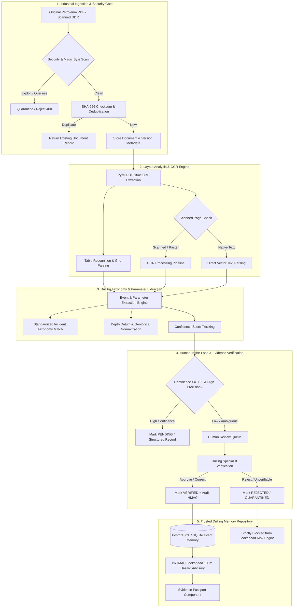
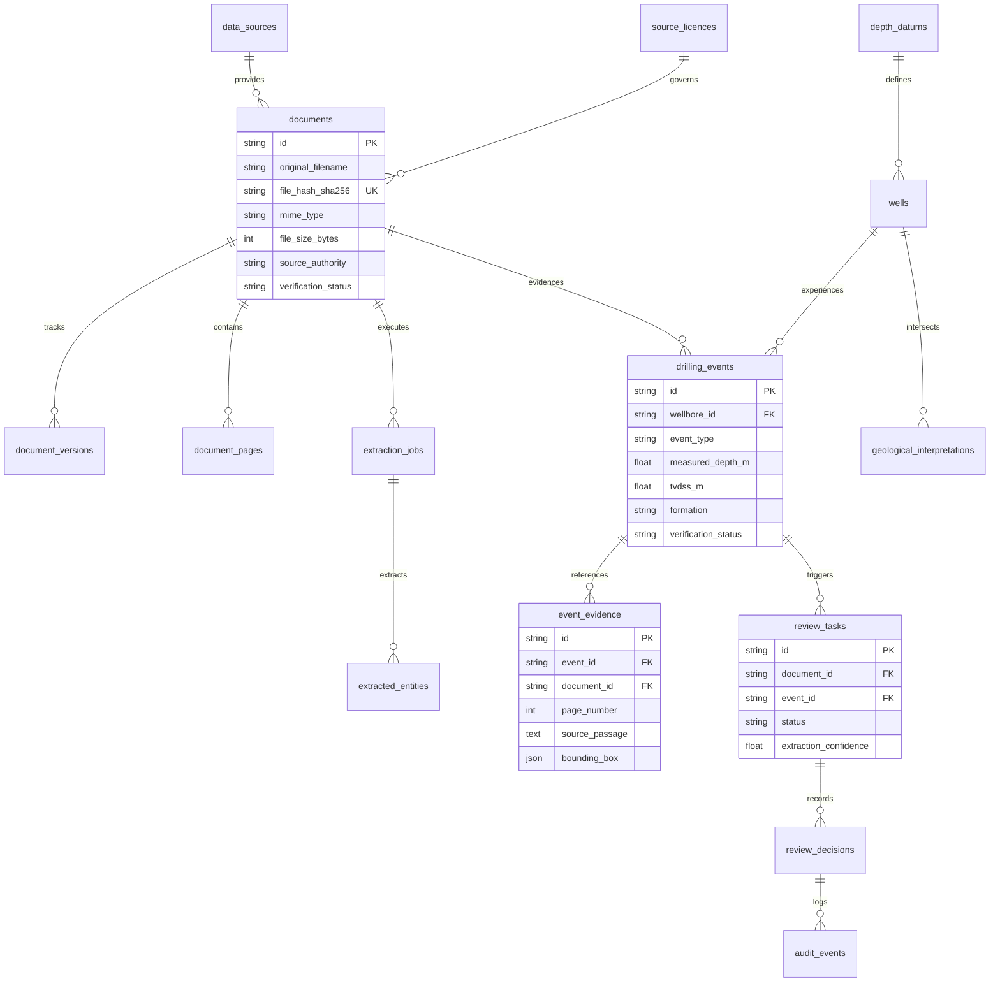

# eRTMAC-NWIS: Phase 2 Production Document Intelligence, Verified Drilling Memory & Trusted Data Architecture
**Document ID:** `NWIS-DOC-PHASE02-ARCH-001`  
**Standard:** Industrial-Grade Drilling Intelligence Architecture (SIH26121)  
**Target Organization:** Oil India Limited (OIL) — Duliajan Field Headquarters & Remote Real-Time Drilling Monitoring  
**Release Date:** September 2026  
**Status:** **IMPLEMENTED, VALIDATED & OPERATIONAL**

---

## 1. Executive Architecture Summary

The **eRTMAC-NWIS Phase 2 Document Intelligence Subsystem** bridges the critical gap between unstructured, disparate historical petroleum documents (Daily Drilling Reports, Well Completion Reports, mud logs, scanned tour sheets) and the high-reliability real-time lookahead decision engine.

Rather than implementing a generic PDF-to-chatbot application or an ungrounded Retrieval-Augmented Generation (RAG) prototype, NWIS implements a **deterministic, layout-aware, evidence-grounded document intelligence pipeline**. Every extracted engineering parameter, geological formation pick, and drilling incident is strictly bound to its physical source: original document hash, exact page number, text passage, and spatial bounding box coordinates.

---

## 2. Component Breakdown & Functional Specifications

### Stage 1: Industrial Ingestion Pipeline
- **Supported Petroleum Ingestion Formats:** Native vector PDFs, scanned legacy DDR PDFs, WITSML XML, structured CSV tabular mud logs, multi-page Well Completion Reports (WCRs).
- **Security Pre-Filter:**
  - Enforces a 50 MB file size limit to prevent memory-exhaustion denial of service.
  - Verifies PDF magic bytes (`%PDF-`) at byte offset 0.
  - Scans raw byte streams for malicious active PDF tokens (`/JavaScript`, `/JS`, `/Launch`, `/EmbeddedFiles`). Any document containing active exploit vectors is rejected immediately with HTTP 400.
- **Cryptographic Deduplication:**
  - Calculates SHA-256 checksums across all incoming raw files.
  - Queries `Document` table by `file_hash`. If an identical document exists, returns the existing record idempotently without duplicating historical incidents or triggering redundant OCR compute.
- **Metadata Preservation:**
  - Captures original filename, source authority (e.g., Equinor Volve, NOPIMS, OIL Databank), dataset identifier, official wellbore ID, licence metadata, source publication date, and ingestion timestamp.

### Stage 2: Real OCR & Layout Understanding
- **Layout-Aware Extraction Engine:**
  - Uses high-performance PyMuPDF (`fitz`) to extract structured text blocks with exact bounding box coordinates `[x0, y0, x1, y1]`.
  - Employs PyMuPDF table finder (`page.find_tables()`) to reconstruct structured tabular grids from daily shift remarks, BHA summaries, and mud logging logs.
- **Adaptive OCR for Scanned Reports:**
  - Evaluates page vector density. Pages containing fewer than 50 text characters or lacking vector glyphs are automatically classified as `is_scanned = True`.
  - Scanned pages are rasterized at 150 DPI and processed through dedicated OCR engines (PaddleOCR / Tesseract fallback) to extract legacy typewriter and dot-matrix operational logs.
- **Passage Coordinate Preservation:**
  - Every extracted observation or incident retains its original page number and exact bounding box coordinates.
  - The rendering engine generates high-fidelity PNG snippets with highlighted yellow-transparent bounding boxes (`rgba(255, 220, 0, 0.45)`) superimposed onto the original document page.

### Stage 3: Structured Drilling Event Taxonomy
The subsystem implements a standardized petroleum drilling incident taxonomy adhering to IADC/SPE standards:
1. `LOST_CIRCULATION`: Total/partial loss of mud volume, seepage losses, fractured formations.
2. `STUCK_PIPE`: Differential sticking, mechanical sticking, key seating, hole packoff.
3. `PACKOFF`: Sudden annular bridging, pump pressure spikes, loss of rotation/reciprocation.
4. `TIGHT_HOLE`: Overpull during tripping, hole closure, swelling shale, ballooning.
5. `KICK`: Formation fluid influx, pit gain, shut-in casing pressure anomaly.
6. `ABNORMAL_PRESSURE`: Overpressured shale, rapid drilling break, gas cutting.
7. `TORQUE_DRAG_ANOMALY`: Erratic torque spikes, severe drag trends, dogleg severity issues.
8. `FISHING_OPERATIONS`: Twisted-off drill string, dropped cones, jar activations, washpipe operations.
9. `CASING_PROBLEMS`: Casing collapse, parted casing, shoe leaks, micro-annular leaks.
10. `CEMENTING_PROBLEMS`: Channeling, flash set, incomplete displacement, top of cement deficit.
11. `NON_PRODUCTIVE_TIME`: Documented Rig NPT hours, waiting on weather, rig equipment failure.

#### Strict Entity Schema
For every detected incident, the system extracts:
- `event_id`: Unique deterministic UUID.
- `wellbore_id`: Official canonical well identifier (e.g., `NO-15/9-F-14`).
- `event_type`: Categorized taxonomy term.
- `measured_depth_m` & `tvdss_m`: Physical depths normalized to Mean Sea Level (MSL).
- `formation`: Standardized geological lithostratigraphic unit (e.g., Hugin, Skagerrak, Heather).
- `hole_section`: Hole size (e.g., `12 1/4"`, `8 1/2"`).
- `operating_parameters`: JSON object with Mud Weight (SG), Flow Rate (LPM), ROP (m/hr), RPM, Standpipe Pressure (bar/psi).
- `documented_mitigations`: Exact recorded field actions (e.g., "Pumped 25 bbl Mica pill", "Worked pipe with max pull").
- `documented_outcome`: Actual physical result (e.g., "Full returns restored", "Severed drillstring at 3012m").
- `source_passage`: Verbatim unedited sentence from the original report.
- `page_number`: 1-indexed document page number.
- `bounding_box`: `[x0, y0, x1, y1]` coordinates in PDF points.
- `confidence_score`: Extraction confidence ($0.0 - 1.0$).
- `verification_status`: `VERIFIED`, `PENDING_REVIEW`, `CONFLICTING_EVIDENCE`, `INSUFFICIENT_SOURCE`, `REJECTED`.

### Stage 4: Evidence Passport Component
The **Evidence Passport** is a standardized, reusable verification contract designed for petroleum engineers and drilling superintendents. For any historical incident surfaced during offset-well analysis, the Evidence Passport answers the **8 Mandatory Engineering Verification Questions**:

| # | Verification Question | Field in Evidence Passport | Engineering Verification Purpose |
| :- | :--- | :--- | :--- |
| **Q1** | **WHAT HAPPENED?** | `event_type` & `event_description` | Eliminates ambiguous summaries; specifies exact physical drilling failure mode. |
| **Q2** | **WHICH WELLBORE EXPERIENCED IT?** | `wellbore_id` & `well_name` | Confirms spatial offset relationship and platform slot context. |
| **Q3** | **WHEN DID IT HAPPEN?** | `event_timestamp` & `report_date` | Establishes chronological sequence; prevents time-leakage in predictive algorithms. |
| **Q4** | **AT WHAT DEPTH?** | `measured_depth_m` & `tvdss_m` | Distinguishes along-hole length from true vertical reservoir depth. |
| **Q5** | **WHICH GEOLOGICAL INTERVAL?** | `formation_name` & `stratigraphic_unit` | Verifies lithological hazard correlation across fault blocks and formations. |
| **Q6** | **WHAT DOES THE ORIGINAL REPORT SAY?** | `verbatim_source_text` & `highlighted_snippet_url` | Displays exact unedited supervisor remark and high-resolution visual evidence page. |
| **Q7** | **WHAT INFORMATION IS MISSING?** | `missing_information_flags` | Explicitly lists unrecorded parameters (e.g., missing pump pressure or ECD). |
| **Q8** | **HAS THE RECORD BEEN VERIFIED?** | `verification_status` & `reviewer_identity` | Confirms whether an authorized petroleum engineer has audited the extraction. |

#### Deterministic PDF Viewer Integration
When an engineer clicks "View Source PDF at Page N", the backend generates a signed, authenticated URL that opens the authorized document directly at the target page with highlight parameters:
`GET /api/v1/documents/{document_id}/page/{page_number}/image?highlight_passage=...`

### Stage 5: Human-in-the-Loop Review System
- **Dual-State Parameter Preservation:**
  - Automated extractions are stored in `extracted_entities`.
  - When an engineer reviews an event via `POST /api/v1/review/{task_id}/decision`:
    - The original raw extraction is preserved permanently in the audit trail.
    - The engineer's corrected value is committed to `historical_events`.
    - Automated background workers are cryptographically blocked from overwriting human-verified values.
- **Cryptographic Audit Trail:**
  - Every decision (`APPROVED`, `REJECTED`, `MODIFIED`) writes a tamper-evident record into `audit_events` with an SHA-256 HMAC digest, reviewer username, client IP, timestamp, and field-level diff.
- **Fail-Safe Lookahead Isolation:**
  - The lookahead risk engine (`backend/app/services/risk_service.py`) executes a mandatory filter:
    `WHERE verification_status == 'VERIFIED'`.
  - Records in `PENDING_REVIEW`, `INSUFFICIENT_SOURCE`, or `REJECTED` are strictly quarantined and never surfaced in active drilling hazard advisories.

---

## 3. Production Database Architecture (20 Normalized Tables)

The persistent database layer is designed for enterprise PostgreSQL with PostGIS and pgvector extensions (and fully backwards-compatible with SQLite for self-contained validation):

### Complete Schema Catalog:
1. `wells`: Master wellbore registry, platform slot, coordinates, water depth, spud/completion dates.
2. `formation_tops`: Canonical stratigraphic boundary picks (MD, TVD, TVDSS).
3. `surveys`: Directional survey stations with Minimum Curvature dogleg severity calculations.
4. `historical_events`: Master drilling incidents with operational parameters and verification state.
5. `data_sources`: Verified authority repository (NPD FactPages, Equinor Volve, OIL Databank).
6. `source_licences`: Legal licensing terms, redistribution rights, and commercial caveats.
7. `documents`: Master ingestion registry with SHA-256 hashes, file metadata, and security flags.
8. `document_versions`: Revision history tracking for amended reports and revised completions.
9. `document_pages`: Per-page layout classification (native vs scanned, character count, DPI).
10. `extraction_jobs`: Processing queue jobs tracking OCR and extraction pipeline states.
11. `extracted_entities`: Raw, pre-review OCR entity extractions with bounding box coordinates.
12. `drilling_events`: Production event table populated from verified extractions.
13. `event_evidence`: Source-linking table tying incidents to exact PDF pages and verbatim passages.
14. `geological_interpretations`: Chronostratigraphic formation picks with fault block interpretations.
15. `depth_datums`: Rig floor elevations (KB), Kelly Bushing to MSL references, water depths.
16. `review_tasks`: Human-in-the-loop review queues sorted by extraction uncertainty.
17. `review_decisions`: Permanent engineering review decisions (`APPROVED`, `REJECTED`, `MODIFIED`).
18. `audit_events`: Cryptographically hashed audit trails for tamper-evident compliance.
19. `telemetry_logs`: Real-time sensor channels (WITS/WITSML 1Hz/10s streams).
20. `risk_lookahead_cache`: Precomputed offset hazard lookahead horizons.

---

## 4. Industrial Security & Operational Resilience

1. **Untrusted Input Sandboxing:**
   - All uploaded documents are treated as untrusted binary payloads.
   - Text extracted from historical reports is strictly segregated from system prompts; document text is never evaluated as code or executable instructions.
2. **Malicious Content Protection:**
   - Active scanning for embedded PDF streams, JavaScript actions (`/JS`), external URI launch triggers (`/Launch`), and executable streams.
3. **Graceful LLM Degradation:**
   - The core document intelligence pipeline is powered by deterministic regex, layout parsing, and keyword matching.
   - If an external cloud LLM service experiences an outage or network disconnect, the entire ingestion, OCR, extraction, and verification workflow continues operating offline without service interruption.
4. **Idempotent Ingestion:**
   - Re-uploading an existing historical report does not generate duplicate records or duplicate risk alerts. The system detects the matching SHA-256 hash and links existing evidence.

---

## 5. Enterprise API Specifications

- `POST /api/v1/documents/upload`: Multipart upload with real-time security scanning and idempotent deduplication.
- `GET /api/v1/documents`: Filterable document list with status, verification state, and pagination.
- `GET /api/v1/documents/{id}/summary`: Comprehensive document metadata, extracted entities, and evidence links.
- `GET /api/v1/documents/{id}/page/{page_number}/image`: High-resolution rendered page PNG with highlighted passage bounding boxes.
- `GET /api/v1/evidence/event/{event_id}/passport`: Complete 8-question Evidence Passport contract.
- `GET /api/v1/review/tasks`: Review queue filterable by status (`PENDING`, `APPROVED`, `REJECTED`).
- `POST /api/v1/review/{task_id}/decision`: Engineer approval, correction, or rejection with mandatory audit logging.
