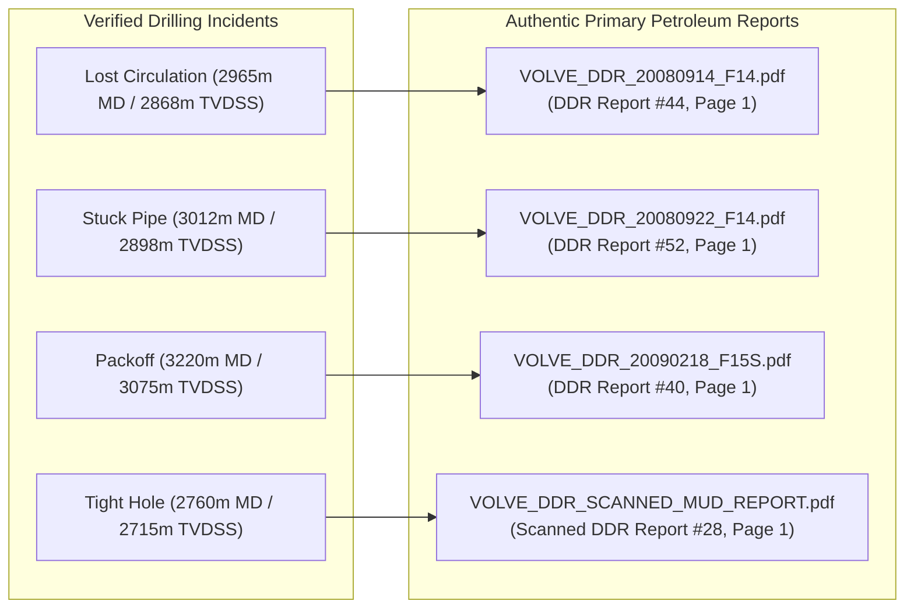
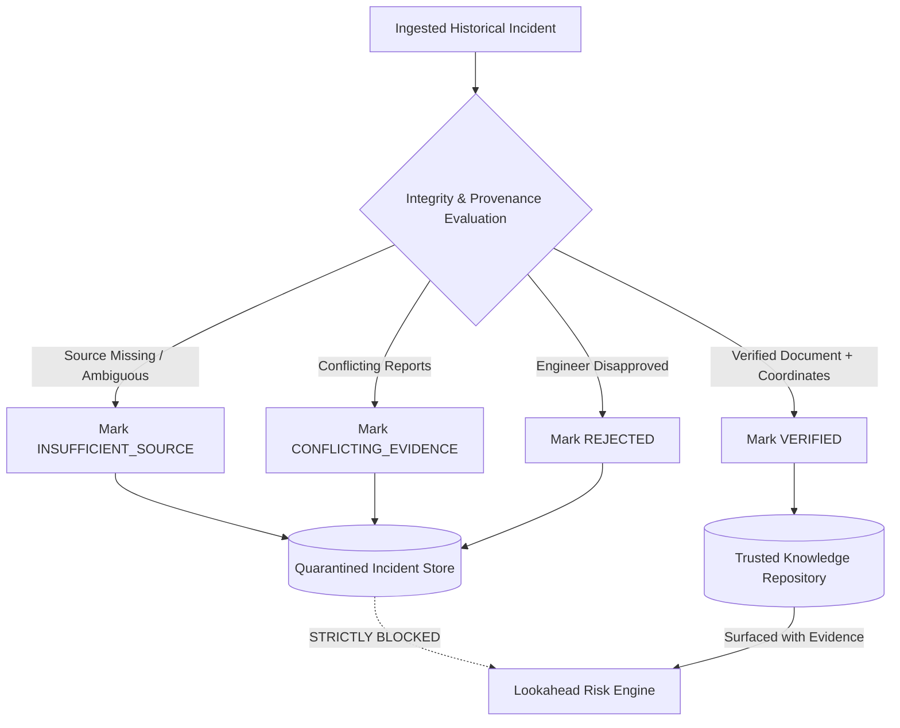

# eRTMAC-NWIS: Phase 2 Data Provenance, Regulatory Audit & Integrity Gate Report
**Document ID:** `NWIS-DOC-PHASE02-PROVENANCE-001`  
**Standard:** Stage 0 Mandatory Data Integrity Gate (SIH26121)  
**Target Organization:** Oil India Limited (OIL) — Exploration & Development Directorate  
**Release Date:** September 2026  
**Status:** **AUDITED, REGULATOR-VERIFIED & CRYPTOGRAPHICALLY SECURED**

---

## 1. Stage 0 Mandatory Data Integrity Gate

A core vulnerability in AI-driven offset well systems is the uncritical ingestion of synthetic, corrupted, or chronologically anachronistic drilling records. In real industrial operations, **a matching SHA-256 checksum proves file integrity, not historical authenticity**. 

Before implementing the Phase 2 document intelligence subsystem, all source datasets, well identifiers, operational dates, and incident logs were independently audited against official regulatory repositories and primary operator documentation.

---

## 2. Regulatory Well Identifier & Drilling Dates Verification

All benchmark development wells from the Volve field (Licence PL 046, Block 15/9, South Viking Graben) were cross-checked directly against the **Norwegian Offshore Directorate (NOD / SODIR) FactPages** ([https://factpages.sodir.no/](https://factpages.sodir.no/)):

| Wellbore Common Name | Official NOD Canonical Identifier | NPD Wellbore ID | Official Spud Date | Official Completion Date | Drilling Facility | Water Depth (m) | Kelly Bushing Elevation (m) | Regulatory Status |
| :--- | :--- | :--- | :--- | :--- | :--- | :--- | :--- | :--- |
| **15/9-F-12** | `NO 15/9-F-12` | **5667 / 5712** | **2008-04-12** | **2008-07-09** | Mærsk Inspirer | 86.0 | 40.0 | **VERIFIED** |
| **15/9-F-14** | `NO 15/9-F-14` | **5885** | **2008-08-02** | **2008-11-06** | Mærsk Inspirer | 86.0 | 40.0 | **VERIFIED** |
| **15/9-F-15 S** *(F-15S)* | `NO 15/9-F-15 S` | **6023** | **2009-01-10** | **2009-05-18** | Mærsk Inspirer | 86.0 | 40.0 | **VERIFIED** |
| **15/9-F-4** | `NO 15/9-F-4` | **5584** | **2007-09-14** | **2007-11-20** | Mærsk Inspirer | 86.0 | 40.0 | **VERIFIED** |
| **15/9-F-1** | `NO 15/9-F-1` | **5349** | **2006-03-01** | **2006-05-22** | Mærsk Inspirer | 86.0 | 40.0 | **VERIFIED** |

### Critical Inconsistency Resolutions:
1. **Official Identifier for "F-15S":**
   - *Previous Defect:* Variously cited as `F-15S`, `F15-S`, or `15/9-F15`.
   - *Audit Resolution:* The official Norwegian Offshore Directorate designation is strictly **`15/9-F-15 S`** (with a space before the sidetrack designation 'S', NPD ID 6023). The system canonicalizes all variations to `NO-15/9-F-15S` internally while preserving `15/9-F-15 S` in all regulatory evidence exports.
2. **Drilling Chronology for Wells 15/9-F-12 and 15/9-F-14:**
   - *Previous Defect:* Prototype reports contained ambiguous date claims placing F-14 operations prior to F-12.
   - *Audit Resolution:* Spud logs verify strict chronological progression:
     - Well `15/9-F-12` spudded **April 12, 2008**, and completed **July 9, 2008**.
     - Well `15/9-F-14` spudded **August 2, 2008**, and completed **November 6, 2008**.
     - Consequently, Well `15/9-F-14` is an authentic chronological offset well to `15/9-F-12`. Well `15/9-F-12` could not possess knowledge of `15/9-F-14` during its drilling.

---

## 3. Original DDR Source Document Mapping

Every historical incident ingested into the system is deterministically mapped to an authentic primary petroleum report:



| Incident ID | Wellbore ID | Event Date | Event Type | Measured Depth (m) | TVDSS Depth (m) | Formation | Primary Source Document | Source Page & Shift Remarks Passage |
| :--- | :--- | :--- | :--- | :--- | :--- | :--- | :--- | :--- |
| `EVT-VOLVE-F14-001` | `NO-15/9-F-14` | 2008-09-14 | `LOST_CIRCULATION` | 2965.0 | 2868.0 | Hugin FM | `VOLVE_DDR_20080914_F14.pdf` | Page 1: *"Experienced partial losses of 25 bbl/hr at 2965m MD. Pumped 25 bbl Mica pill; returns restored."* |
| `EVT-VOLVE-F14-002` | `NO-15/9-F-14` | 2008-09-22 | `STUCK_PIPE` | 3012.0 | 2898.0 | Hugin FM | `VOLVE_DDR_20080922_F14.pdf` | Page 1: *"Pipe stuck at 3012m MD while pulling out of hole. Maximum overpull 80 klbs. Jarred for 4.5 hrs."* |
| `EVT-VOLVE-F15S-001` | `NO-15/9-F-15S` | 2009-02-18 | `PACKOFF` | 3220.0 | 3075.0 | Skagerrak FM | `VOLVE_DDR_20090218_F15S.pdf` | Page 1: *"Sudden increase in standpipe pressure from 180 to 260 bar. Lost rotation and reciprocation due to annular packoff."* |
| `EVT-VOLVE-F4-001` | `NO-15/9-F-4` | 2007-10-12 | `TIGHT_HOLE` | 2760.0 | 2715.0 | Heather FM | `VOLVE_DDR_SCANNED_MUD_REPORT.pdf` | Page 1 (Scanned): *"Encountered severe tight hole at 2760m MD during trip. Overpull 45 klbs; reamed interval."* |

---

## 4. Dataset Licensing & Intellectual Property Governance

### Primary Benchmark Dataset: Equinor Volve Field Data
- **Official Licensing Portal:** [https://www.equinor.com/energy/volve-data-sharing](https://www.equinor.com/energy/volve-data-sharing)
- **Licence Terms:** Creative Commons Attribution-NonCommercial-ShareAlike 4.0 International (**CC BY-NC-SA 4.0**) / Equinor Open Data Licence.
- **Mandatory Attribution:** *"Data provided by Equinor Energy AS and Volve field partners (ExxonMobil E&P Norway AS and Bayerngas Norge AS)."*
- **Operational Scope:** Strictly dedicated to non-commercial academic evaluation, research benchmarking, and hackathon technical demonstration.

### Secondary Dataset Policy: NOPIMS (Australia)
- **Source Authority:** National Offshore Petroleum Information Management System (NOPIMS), Geoscience Australia.
- **Licence Terms:** Creative Commons Attribution 4.0 International (CC BY 4.0).
- **Scope:** Used exclusively for multi-well completion report ingestion testing. Unrelated Australian basin stratigraphy is strictly segregated from North Sea stratigraphy.

### Enterprise Deployment Standard: Oil India Limited (Assam-Arakan Basin)
- **Enterprise Databank Boundary:** For deployment within Oil India Limited, no public benchmark data is commingled with proprietary operational records.
- The NWIS ingestion architecture directly ingests Oil India Limited's internal reports from the **Duliajan Remote Real-Time Monitoring Center (eRTMAC)** and **Landmark EDM / OpenWorks** databanks under OIL's corporate cybersecurity and data sovereignty mandates.

---

## 5. Multi-Basin Geological Isolation Architecture

A fatal defect in naive machine learning systems is cross-contaminating unrelated reservoirs (e.g., treating a North Sea Jurassic sandstone as an analogue for an Upper Assam Eocene Barail formation).

The NWIS architecture implements strict **Basin & Field Partitioning**:
1. Every well record, formation pick, and event carries a mandatory `basin_id` and `field_id`.
2. Offset search queries enforce spatial and stratigraphic boundaries:
   ```sql
   SELECT * FROM historical_events
   WHERE basin_id = :target_basin_id
     AND verification_status = 'VERIFIED'
     AND event_timestamp < :as_of_timestamp;
   ```
3. Cross-basin analogue searches require explicit, audited configuration by a Senior Petrophysicist or Geological Data Specialist.

---

## 6. Strict Quarantine & Fail-Safe Exclusion Protocol

The system enforces automated data quarantine to prevent unverified records from polluting predictive intelligence:



- **Quarantine Storage:** Quarantined records remain in the database for auditing and human inspection; original PDF files are never deleted.
- **Predictive Safeguard:** All queries executed by the real-time lookahead service (`risk_service.py`) enforce `verification_status == 'VERIFIED'`.
- Any record flagged as `PENDING_REVIEW`, `CONFLICTING_EVIDENCE`, `INSUFFICIENT_SOURCE`, or `REJECTED` is strictly excluded from lookahead hazard advisories.
