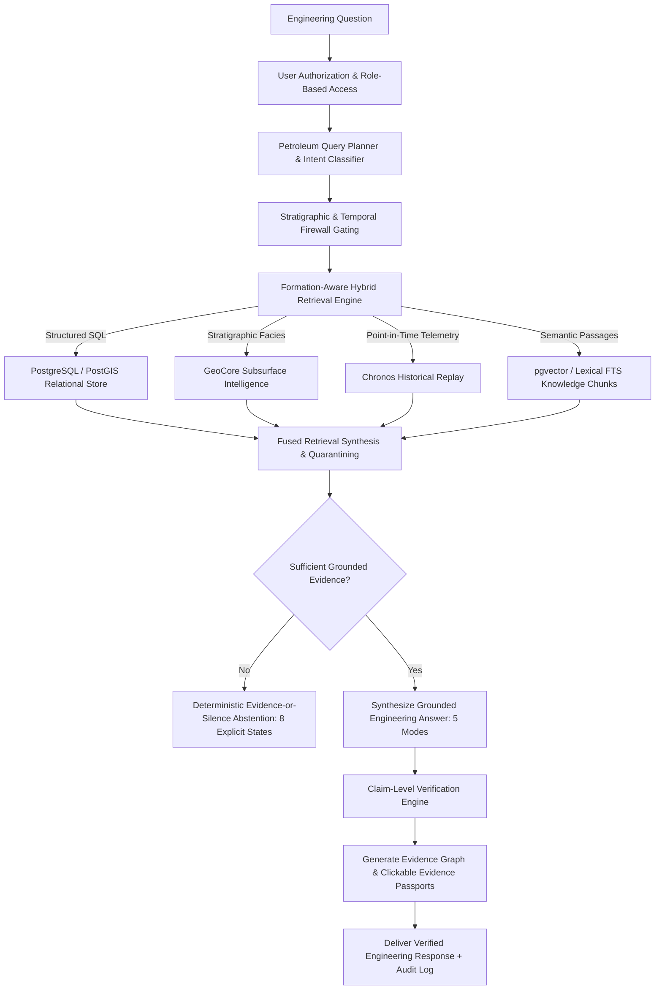

# NWIS SENTINEL — ENGINEERING INTELLIGENCE SYSTEM ARCHITECTURE
## Signature Petroleum Engineering Intelligence Subsystem for Oil India Limited (eRTMAC)

### 1. Executive Summary
**NWIS Sentinel** is a deterministic, formation-aware engineering intelligence platform designed to support mission-critical drilling engineering workflows. Unlike generic conversational chatbots or conventional naive semantic retrieval-augmented generation (RAG) frameworks, Sentinel enforces the fundamental engineering requirement that **AI systems must never fabricate petroleum measurements, wellbore depths, historical tour sheets, or stratigraphic conclusions.**

Every response emitted by Sentinel is bound to an independently auditable **7-Node Evidence Graph**, subject to strict point-in-time temporal causality, and governed by deterministic **Evidence-or-Silence** abstention protocols.

---

### 2. High-Level Intelligence Pipeline

---

### 3. Core Architectural Modules

#### 3.1 Petroleum-Aware Engineering Query Planner (`sentinel_query_planner.py`)
- **Deterministic Entity Extraction**: Identifies target wellbores (e.g., `NO-15/9-F-14`), offset comparison candidates (e.g., `NO-15/9-F-12`), geological formations (`Hugin FM`, `Sleipner FM`), drilling hazard categories (`LOST_CIRCULATION`, `STUCK_PIPE`, `GAS_KICK`), and explicit depth boundaries.
- **Strict Depth Datum Validation**: Disallows ambiguous depth filtering without specified datum. Enforces clear demarcation between Measured Depth (MD) and True Vertical Depth Subsea (TVDSS). **Never silently substitutes MD for TVDSS.**
- **Adversarial Sanitization**: Identifies prompt-injection patterns, malicious SQL delimiters, and system override attempts, neutralizing untrusted input before query execution.

#### 3.2 Formation-Aware Hybrid Retrieval Engine (`sentinel_retrieval_engine.py`)
Combines four complementary retrieval modalities into an integrated evidence package:
1. **Structured Relational Retrieval**: Queries verified `drilling_events`, `wellbores`, and operational drilling parameters.
2. **Geospatial Retrieval (PostGIS)**: Ranks candidate wellbores by surface proximity and 3D subsurface trajectory separation.
3. **Geological Stratigraphic Retrieval (GeoCore)**: Correlates target formations across structural fault blocks, calculates facies similarity (e.g., Hugin reservoir sand vs. Sleipner coal-bearing clastics), and determines true stratigraphic alignment.
4. **Semantic & Lexical Chunk Retrieval (pgvector & FTS)**: Retrieves audited passages from Daily Drilling Reports (DDRs) and Well Completion Reports (WCRs), preserving exact bounding boxes and SHA-256 integrity checksums.

#### 3.3 Evidence-Level Claim Verification & Abstention Engine (`sentinel_verification_service.py`)
- **Claim-Level Grounding**: Breaks down synthesized statements into atomic factual claims, independently verifying each claim against certified knowledge chunks.
- **Deterministic Abstention**: When evidence is missing, conflicting, temporally disqualified, or unverified, Sentinel halts generation and returns one of 8 standardized abstention codes:
  - `NO_HISTORICAL_EVIDENCE`
  - `INSUFFICIENT_GEOLOGICAL_EVIDENCE`
  - `SOURCE_UNAVAILABLE`
  - `CONFLICTING_SOURCE_RECORDS`
  - `UNVERIFIED_EVENT`
  - `UNAUTHORIZED_SOURCE`
  - `TEMPORALLY_INELIGIBLE_EVIDENCE`
  - `INSUFFICIENT_DATA_FOR_PREDICTION`

#### 3.4 Multi-Modal Engineering Answer Engine (`sentinel_answer_engine.py`)
Provides dynamic switching between 5 tailored presentation modes:
- **TEXT MODE**: Rigorous technical narrative with inline citation links.
- **TABLE MODE**: Comparative multi-well matrix comparing operating parameters, bit depths, and incident severities.
- **GEOLOGICAL MODE**: Stratigraphic corridor alignment, formation tops, and fault-block dip analysis.
- **EVIDENCE MODE**: Side-by-side display of original tour sheet passages with bounding boxes and document checksums.
- **CHRONOS MODE**: Historical event timeline, time-to-incident lead times, and early-warning advisory records.

---

### 4. Relational PostgreSQL Knowledge Schema
The Sentinel architecture extends PostgreSQL with five specialized tables:
- `knowledge_chunks`: Stores verified document chunks, exact bounding boxes, page numbers, TVDSS/MD intervals, and SHA-256 document checksums.
- `chunk_embeddings`: Stores versioned vector embeddings for semantic similarity search.
- `query_plans`: Records parsed query ASTs, extracted entities, and safety checks.
- `answer_claims`: Logs all synthesized claims, verification statuses, confidence scores, and citation markers.
- `generation_audits`: Immutable audit trail capturing user ID, session ID, latency, model provider, and retrieval counts.

---

### 5. UI Integration Architecture
Sentinel is integrated directly into the NWIS industrial workspace via `/sentinel.html` and `/app/sentinel`, featuring:
- **Left Panel**: Target well selector, formation pick list, TVDSS/MD datum toggle, depth bounds, cutoff date, and one-click engineering presets.
- **Center Panel**: Engineering inquiry input, 5-mode presentation switch, verified claims list, abstention indicator, and follow-up chips.
- **Right Panel**: Interactive 7-Node Evidence Graph, clickable knowledge chunks, and links to GeoCore and Chronos.
- **Bottom Panel**: Retrieval transparency metrics (structured count, semantic chunks, quarantined future documents, latency) and 4-way baseline comparison.
